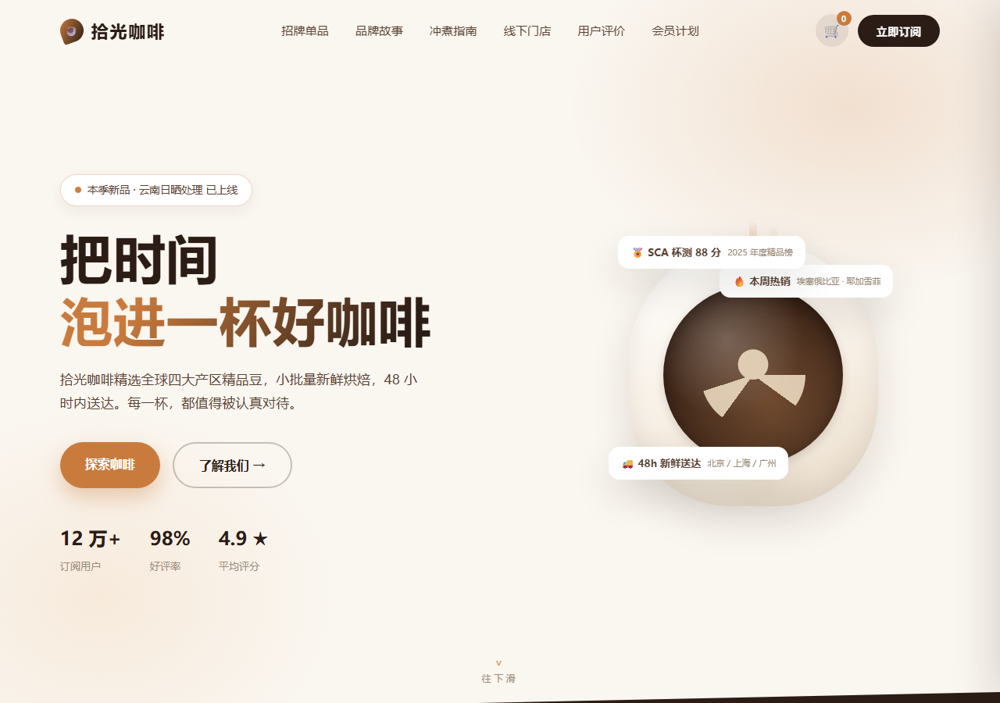

# qwen3.8_27b_web

**拾光咖啡 · Shiguang Coffee** —— 一个单文件、零依赖的精品咖啡订阅品牌演示页。

> 「把时间泡进一杯好咖啡。」



## 这是什么

一个完全自包含的演示网页：结构、样式（内联 CSS）与全部交互逻辑（内联 JavaScript）
都写在**同一个 HTML 文件**里，不含任何外部资源、前端框架或构建步骤——
视觉全部由 emoji / CSS / 内联 SVG 完成，无位图资产。用浏览器直接打开即可运行。

- 入口：[`index.html`](./index.html)（约 91 KB）
- 无外部依赖：无 CDN、无字体文件、无图片资源、无 npm / 打包器

## 页面包含（演示功能）

| 区块 | 说明 |
| --- | --- |
| 招牌单品 | 5 款风味卡，可按「花果香 / 发酵甜 / 醇厚 / 国产限定 / 秋日限定」筛选；含风味条动画、烘焙度点、限量库存条 |
| 烘焙批次倒计时 | 开炉前实时倒计时（演示，非固定日期） |
| 品牌故事 / 时间线 / 统计 | CSS 故事砖、纵向时间线、数字滚动统计 |
| 四大产区直采 | 内联 SVG 简化地图（脉冲标记 + 图例）+ 溯源卡 |
| 烘焙流程 | 四步流程 + 内联 SVG「烘焙曲线」结构示意（滚动进入视口时描线绘入） |
| 冲煮指南 | 三种冲法参数、**冲煮比例计算器**（粉量 × 比例实时换算）、**冲煮计时器**（conic-gradient 进度环） |
| 线下门店 | 三家门店信息（营业 / 服务 / 特色） |
| 礼品卡 | 可选面额的卡面视觉（演示） |
| 会员计划 | 三档订阅 + 邮箱领券（演示） |
| 评价轮播 / FAQ | 自动轮播（hover 暂停）/ 手风琴问答 |
| 购物袋 | 侧滑抽屉：加购、增减数量、结算演示、Toast 提示 |

## 技术要点

- 单文件 HTML：`<!DOCTYPE html>` → 一个 `<style>` + 一个顶层 `<script>`
- 原生 Web：`IntersectionObserver`（滚动显现 / 导航高亮 / 统计）、`requestAnimationFrame`、
  `conic-gradient`、`prefers-reduced-motion` 降级
- 视觉：emoji + CSS + 内联 SVG，无位图资产，无外部网络请求
- 无框架、无打包器、无运行时依赖

## 如何查看

```bash
# 本地：直接用浏览器打开
start index.html        # Windows
open index.html         # macOS

# 或 GitHub Pages：仓库 Settings → Pages → 选 main 分支，即可在线访问
```

## 由谁生成

本页面由大语言模型 **qwen 3.8 27b**（多模态）在 DeepSeek Harness（`dsh`）会话中生成与迭代，
用于展示单文件前端页面的构建能力。

> ⚠️ 演示页：品牌、价格、门店、评价与统计均为**虚构示例**，不构成任何真实商品或服务。
